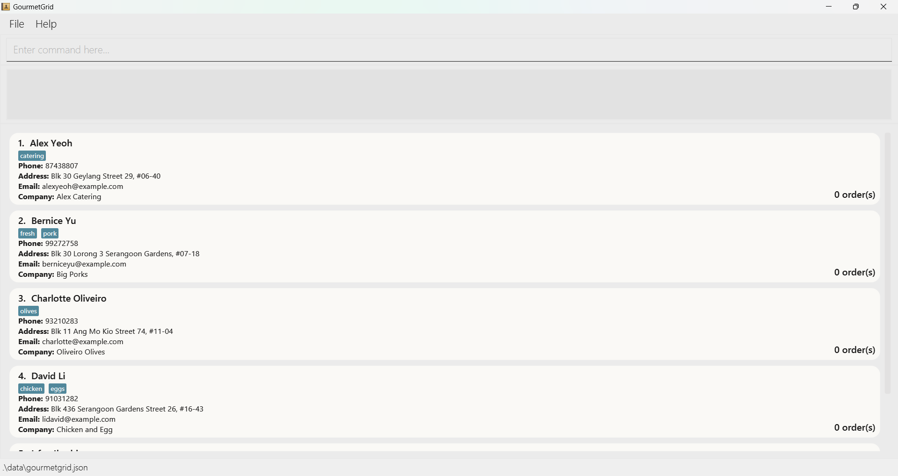

# GourmetGrid User Guide

<!-- * Table of Contents -->
- Introduction
- About
- Quick Start
- Features
    - Adding a contact : add
    - Listing all contacts : list
    - Editing a contact : edit
    - Adding contacts as favourites : addfav
    - Listing favourite contacts : listfav
    - Removing contacts from favourites : removefav
    - Searching contact : find
    - Adding an order : addorder
    - Listing orders : listorder
    - Deleting an order: deleteorder
    - Deleting a contact : delete
    - Clearing all entries : clear
    - Exiting a program : exit
    - Viewing help : help
    - Saving the data
    - Editing the data file
- FAQ
- Known Issues
- Command Summary

--------------------------------------------------------------------------------------------------------------------

## Introduction

GourmetGrid is a **desktop app to help small restaurant owners manage contact contacts and orders**, optimized for use via a Command Line Interface (CLI) while still having the benefits of a Graphical User Interface (GUI). If you can type fast, GourmetGrid can get your day-to-day contact management tasks done faster than traditional GUI apps.

## About
This user guide provides in-depth documentation on GourmetGrid installation process, system configuration and management. From setting up the app to managing contact contacts and orders efficiently, we cover everything you need to know to use GourmetGrid effectively.

### How to Use the Guide

- **Navigation**: Use the Table of Contents to find the sections relevant to your needs. This guide is structured logically from initial setup to more complex features, ensuring you would have a smooth learning curve.

- **Conventions**: Throughout this guide, you will find consistent use of terminology and conventions to simplify understanding. Key terms/features are defined, and step-by-step instructions and examples are clearly outlined for your convenience.

- **Examples**: Practical examples are provided to illustrate how features can be used in real-world scenarios. These are intended to give you a better understanding of how to apply the app's functionalities to meet your needs.

**Getting Started**: If you're new to GourmetGrid, we recommend starting with the 'Quick Start' section to get up and running quickly. From there, explore the 'Features' section to discover how to leverage GourmetGrid's full capabilities.

<page-nav-print />

--------------------------------------------------------------------------------------------------------------------

## Quick start

1. Ensure you have Java `11` or above installed in your Computer. If not, you can download it from [here](https://www.oracle.com/java/technologies/downloads/#java11).

1. Download the latest `gourmetgrid.jar` from [here](https://github.com/AY2324S2-CS2103T-T16-3/tp/releases).

1. Copy the file to the folder you want to use as the _home folder_ for GourmetGrid.

1. Open a command terminal, `cd` into the folder you put the jar file in, and use the `java -jar gourmetgrid.jar` command to run the application. 
   A GUI similar to the screenshot below should appear in a few seconds. Note how the app contains some sample data. 
   

1. Type the command in the command box and press Enter to execute it. e.g. typing **`help`** and pressing Enter will open the help window. 
   Some example commands you can try:

    * `list` : Lists all contacts.

    * `add n/James Lim p/98765432 e/jameslim@example.com a/West Street #01-01 c/The Big Butcher` :
   Adds a contact named `James Lim` with the corresponding details to the contact list.

    * `delete 3` : Deletes the 3rd contact shown in the current list.

    * `clear` : Deletes all contacts.

    * `exit` : Exits the app.

1. Refer to the [Features](#features) below for details of each command. If unsure, you can also key in the command without additional arguments to check the expected command format, which will be shown in the response prompt.

--------------------------------------------------------------------------------------------------------------------

## Features

<box type="info" seamless>

**Notes about the command format:** 

* Words in `UPPER_CASE` are the parameters to be supplied by the user. 
  e.g. in `add n/NAME`, `NAME` is a parameter which can be used as `add n/John Doe`.

* Items in square brackets are optional. 
  e.g `n/NAME [t/TAG]` can be used as `n/John Doe t/bulkseller` or as `n/John Doe`.

* Items with `…`​ after them can be used multiple times including zero times. 
  e.g. `[t/TAG]…​` can be used as ` ` (i.e. 0 times), `t/friend`, `t/friend t/family` etc.

* Parameters can be in any order. 
  e.g. if the command specifies `n/NAME p/PHONE_NUMBER`, `p/PHONE_NUMBER n/NAME` is also acceptable.

* Parameters like `NAME` that follow flags like `n/` can be separated by any number of spaces.  
  e.g. `n/NAME`, `n/ NAME`, `n/  NAME` are valid and may be passed as arguments into commands.

* Extraneous parameters for commands that do not take in parameters (such as `help`, `list`, `exit` and `clear`) are not allowed. 
  e.g. if the command specifies `list 1`, you will be shown an error, to avoid ambiguity.

* If you are using a PDF version of this document, be careful when copying and pasting commands that span multiple lines as space characters surrounding line-breaks may be omitted when copied over to the application.
</box>

### Adding a contact : `add`

Adds a contact to the address book.

Format: `add n/NAME p/PHONE_NUMBER e/EMAIL a/ADDRESS c/COMPANY [t/TAG]…​`

<box type="tip" seamless>

**Note:** Name should only contain alphanumeric characters, spaces, hyphens and/or apostrophes, and should not be blank
**Note:** A contact can have any number of tags (including 0)
</box>

<box type="tip" seamless>

**Note:** Two contacts cannot share the same name, but can share other details including phone number and email.
Because a company phone can be used by multiple people, but the name is used to uniquely determine people.
If two contacts really share a name, find a way to uniquely identify them somehow!
</box>

Examples:
* `add n/John Doe p/98765432 e/johnd@example.com a/John street, block 123 c/John's Burgers`
* `add n/Betsy Crowe t/friend e/betsycrowe@example.com a/West Street 12 p/91234567 c/Great Vegs t/criminal`

### Listing all contacts : `list`

Shows a list of all contacts in the address book, in the order they were added.

Format: `list`
<box type="tip" seamless>

**Reminder:** `list` command is not compatible with further arguments.
</box>

### Editing a contact : `edit`

Edits an existing contact in the address book.

Format: `edit INDEX [n/NAME] [p/PHONE] [e/EMAIL] [a/ADDRESS] [c/COMPANY] [t/TAG]…​`

* Edits the contact at the specified `INDEX`. The index refers to the index number shown in the displayed contact list. The index **must be a positive integer** 1, 2, 3, …​
* At least one of the optional fields must be provided.
* Existing values will be updated to the input values.
* You can remove all the contact’s tags by typing `t/` without
  specifying any tags after it.
* **Warning**: Making any edit to tags will replace all existing tags with the new tags.

Examples:
*  `edit 1 p/91234567 e/johndoe@example.com` Edits the phone number and email address of the 1st contact to be `91234567` and `johndoe@example.com` respectively.
*  `edit 2 n/Betsy Crower t/` Edits the name of the 2nd contact to be `Betsy Crower` and clears all existing tags.

### Adding contacts as favourites : `addfav`

Adds the contacts specified by index as favourites

Format: `addfav i/INDICES`
- Adds the contacts at the specified `INDICES` as favourites. The indices refer to comma-separated index numbers (i.e. index, index, index) shown in the displayed person list. Each index **must be a positive integer** 1,2,3, ...

<box type="tip" seamless>

**Note:** `addfav` issues a warning when the index of a contact that is already marked as favourite is passed as an argument into the command.
</box>

Positive Examples:
- `addfav i/ 1` Sets the contact at index `1` as favourite
- `addfav i/ 1, 1, 1` Sets the contact at index `1` as favourite once
- `addfav i/ 1, 2, 5` Sets the contacts at the indices `1, 2, 5` as favourites

Negative Examples:
- `addfav i/ -10, 0, -100`, `addfav i/ abc` and `addfav i/////` return an error message as the 'INDICES' field must consist of comma-separated positive integers
- `addfav i/ 10, 1` returns an error message as the 'INDICES' field must consist of valid index values which are positive integers from 1 to the total number of contacts in the address book
- `addfav i/` returns an error message as the 'INDICES' field cannot be empty
- `addfav` returns an error message as it must be accompanied by the 'INDICES' field
- `addfav 1 i/ 2, 5` returns an error message as there should not be prefixes before the 'INDICES' field

### Listing favourite contacts : `listfav`

Lists the contacts that are marked as favourites

Format: `listfav`
<box type="tip" seamless>

**Note:** `listfav` **updates** the displayed person list, so commands like `edit` that act with respect to the displayed person list will now act on the list displayed by `listfav`. The `list` command may be used to update the displayed person list to show all contacts again.  
**Reminder:** `listfav` command is not compatible with further arguments.
</box>

Examples:
- `listfav` Lists all favourited contacts as expected
- `listfav 1` returns an error message as there should not be arguments after the `listfav` command word
- `listfav hello` returns an error message as there should not be arguments after the `listfav` command word

### Removing contacts from favourites : `removefav`

- Removes the contacts specified by index as favourites

Format: `removefav i/INDICES`

- Removes the contacts at the specified `INDICES` from favourites. The indices refer to comma-separated index numbers (i.e. index, index, index) shown in the displayed contact list. Each index **must be a positive integer** 1,2,3, ...

<box type="tip" seamless>

**Note:** `removefav` issues a warning when the index of a non-favourite contact is passed as an argument into the command.
</box>

Positive Examples:
- `removefav i/ 1` Removes the contact at index `1` from favourites
- `removefav i/ 1, 1, 1` Removes the contact at index `1` as favourite once
- `removefav i/ 1, 2, 5` Removes the contacts at the indices `1, 2, 5` as favourites

Negative Examples:
- `removefav i/ -10, 0, -100`, `addfav i/ abc` and `addfav i/////` return an error message as the 'INDICES' field must consist of comma-separated positive integers
- `removefav i/ 10, 1` returns an error message as the 'INDICES' field must consist of valid index values which are positive integers from 1 to the total number of contacts in the address book
- `removefav i/` returns an error message as the 'INDICES' field cannot be empty
- `removefav` returns an error message as it must be accompanied by the 'INDICES' field
- `removefav 1 i/ 2, 5` returns an error message as there should not be prefixes before the 'INDICES' field

### Searching Contact : `find`

Search feature supports substring search by name and/or tags and/or company **ONLY**. Finds all contacts whose names, tags or company matches the substring keyword provided.

Format: `find FIELD/KEYWORD [FIELD/KEYWORD]...`

- Where `FIELD` is either `n/` for name or `t/` for tag or `c/` for company.
- Each `FIELD` is optional BUT at least one `FIELD` and `KEYWORD` pair must be provided.
- `KEYWORD` is the keyword to search for, here are some rules:
  - Name and Company should contain alphanumeric characters, spaces, hyphens and/or apostrophes only.
  - Tags should contain alphanumeric characters only.

#### Search Guidelines

* 'KEYWORD' cannot be empty.
    * e.g. `find n/` will **NOT** work as 'KEYWORD' cannot be empty.

* 'KEYWORD' and next 'FIELD' should be separated by a space.
    * e.g. `find n/John t/friends` will find all instances of John that have the tag friends, but `find n/Johnt/tfriends` will instead return an error since it assumes you are searching for 'Johnt/tfriends' and there should not be non-alphabetic characters in the 'KEYWORD' field.

* Multiple Search 'FIELD's will be treated as a **Logical AND (&&)**.
    * e.g. `find n/John n/Doe` will return all instances of John and Doe.
    * e.g. `find n/John t/friends c/ Meat` will return all instances of John that are tagged as friends and have Meat in their company name. This means if there exists a contact with the name John that is tagged as friends but has a company Mat, it will not be returned.
    * e.g. `find n/Ale n/le` can return contacts such as ["Alex Lew", "Alexis Lebrun", "Alec"]

* 'KEYWORD' should **NOT** be empty and there should be at least one 'FIELD' and 'KEYWORD' pair.
    * e.g. `find n/ t/` and `find ` will **NOT** work.

* There should not be prefixes before the first 'FIELD' and 'KEYWORD' pair.
    * e.g. `find testing123 n/John` will **NOT** work.

* The search is case-insensitive.
    * e.g. `find n/hans` will match `Hans Niemann` and `Hans Zimmer`

* The order of the keywords does not matter.
    * e.g. Results of `find n/Hans n/Bo` will match the results of`find n/Bo n/Hans`

* You can have multiple of the same 'FIELD's.
    * e.g. `find n/J n/Do` will match names with `J` AND `Do`, like `John Doe` or `Dohnut Jibs`

Examples:
* `find n/Joh` returns `john`, `John Doe` and `Johnann Sebastian Bach`

* `find n/alex n/david` returns `Alex Davidson` and `David Alexis`

* `find n/Alex t/friends` returns `Alex Yeoh` who is tagged as a `friend`

* `find n////` returns an error message as the 'KEYWORD' field must consist of alphanumeric characters, spaces, hyphens and/or apostrophes only.

* `find n/` or `find t/` or `find n/ t/` returns an error message as the 'KEYWORD' field cannot be empty

* `find` returns an error message as there should be at least one 'FIELD' and 'KEYWORD' pair

* `find testing123 n/John` returns an error message as there should not be
  prefixes before the first 'FIELD' and 'KEYWORD' pair

### Adding an order : `addorder`

Adds an order to a contact.

Format: `addorder INDEX d/DATE r/REMARK`

* Adds an order to the contact at the specified `INDEX`. The index refers to the index number shown in the displayed contact list. The index **must be a positive integer, starting from 1** (1, 2, 3, …​)
* The date must be in the format `YYYY-MM-DD`, where `YYYY` is the year (all the digits, i.e. 2012), `MM` is the month (01 to 12) and `DD` is the day (01 to 31). For example, `2020-12-31`.

<box type="tip" seamless>

**Note:** A contact can have any number of orders (including 0)
</box>

<box type="tip" seamless>

**Note**: You can add an order with the same remark and date to the same supplier multiple times. This is because we understand that you may want to quickly make duplicate orders when demand is high without the hassle of deleting your original order and adding back the updated version again.
</box>

Examples:
* `addorder 1 d/2020-01-01 r/100 chicken wings`
* `addorder 1 r/20 * 150g lettuce d/2020-12-31`
* `addorder 2 r/20 tomatoes, 40 apples (green) d/2020-12-31`

### Listing orders : `listorder`

Shows a list of all orders for a contact, sorted **FIRST** by date from the earliest to the latest and then by the order they were added if the dates are the same.

Format: `listorder INDEX`

* Shows a list of all orders for the contact at the specified `INDEX`. The index refers to the index number shown in the displayed contact list. The index **must be a positive integer, starting from 1** (1, 2, 3, …​)

### Deleting an order : `deleteorder`

Deletes an order from a particular contact.

Format: `deleteorder INDEX o/ORDER_INDEX`

* Deletes a particular order for the contact at the specified `INDEX`. The index refers to the index number shown in the displayed contact list. The index **must be a positive integer, starting from 1** (1, 2, 3, …​)
* The ORDER_INDEX refers to the index number shown in the displayed order list. The order index **must be a positive integer, starting from 1** (1, 2, 3, …​)

**Important Note on Order Index**:
The ORDER_INDEX is determined based on the chronological order of the orders' dates from earliest to the latest (if 2 orders have the same date, they will then be sorted in the order they were added), not the sequence in which the orders were added. This means the orders are sorted by their dates, with the earliest orders appearing first. Hence, it is suggested you first list the orders for a contact to determine the correct order index to delete.

Examples:
* Assuming the 1st contact has 3 orders that were added in the following order:
  * `addorder 1 d/2020-01-01 r/100 chicken wings`
  * `addorder 1 d/2020-01-02 r/200 chicken wings`
  * `addorder 1 d/2019-12-31 r/300 chicken wings`
* `deleteorder 1 o/1` deletes the 1st order for the 1st contact in the address book. Which in the above example will remove the order added by `addorder 1 d/2019-12-31 r/300 chicken wings` Since the orders are sorted by date when added to a contact
* `deleteorder 55 o/1` will return an error message if there is no 55th contact in the address book and the index is invalid
* `deleteorder 1 o/55` will return an error message if there is no 55th order for the 1st contact in the address book and the order index is invalid

### Deleting a contact : `delete`

Deletes the specified contact from the address book.

Format: `delete INDEX`

* Deletes the contact at the specified `INDEX`.
* The index refers to the index number shown in the displayed contact list.
* The index **must be a positive integer** 1, 2, 3, …​

Examples:
* `list` followed by `delete 2` deletes the 2nd contact in the address book.
* `find Betsy` followed by `delete 1` deletes the 1st contact in the results of the `find` command.

### Clearing all entries : `clear`

Clears **all** entries from the address book.

Format: `clear`

<box type="tip" seamless>

**Reminder:** `clear` command is not compatible with further arguments.
</box>

<box type="warning" seamless>

**Caution:**
`clear` command is irreversible as all entries will be lost. Be sure before using this command.
</box>

### Exiting the program : `exit`

Exits the program.

Format: `exit`

<box type="tip" seamless>

**Reminder:** `exit` command is not compatible with further arguments.
</box>

### Viewing help : `help`

Shows a message explaining how to access the help page.

Format: `help`

<box type="tip" seamless>

**Reminder:** `help` command is not compatible with further arguments.
</box>

### Saving the data

GourmetGrid data are saved in the hard disk automatically after any command that changes the data. There is no need to save manually.

### Editing the data file

GourmetGrid data are saved automatically as a JSON file `[JAR file location]/data/gourmetgrid.json`. Advanced users are welcome to update data directly by editing that data file.

<box type="warning" seamless>

**Caution:**
If your changes to the data file makes its format invalid, GourmetGrid will discard all data and start with an empty data file at the next run.  Hence, it is recommended to take a backup of the file before editing it.
Furthermore, certain edits can cause GourmetGrid to behave in unexpected ways (e.g., if a value entered is outside the acceptable range). Therefore, edit the data file only if you are confident that you can update it correctly.
</box>

--------------------------------------------------------------------------------------------------------------------

## FAQ

**Q**: How do I transfer my data to another Computer? 
**A**: Install the app in the other computer and overwrite the empty data file `[JAR file location]/data/gourmetgrid.json` it creates with the file that contains the data of your previous GourmetGrid home folder.

--------------------------------------------------------------------------------------------------------------------

## Known issues

1. **When using multiple screens**, if you move the application to a secondary screen, and later switch to using only the primary screen, the GUI will open off-screen. The remedy is to delete the `preferences.json` file created by the application before running the application again.
2. **When using non ASCII characters**, the application may not display the characters correctly. We currently only support ASCII characters, but we plan to support Unicode characters in the future.
3. **When operating on macOS**, the application may not show bolded text. This is a known issue with the JavaFX library on macOS. Click [here](https://github.com/javafxports/openjdk-jfx/issues/344) for more details.

--------------------------------------------------------------------------------------------------------------------

## Command summary

| Action               | Format, Examples                                                                                                                                                                                |
|----------------------|-------------------------------------------------------------------------------------------------------------------------------------------------------------------------------------------------|
| **Add**              | `add n/NAME p/PHONE_NUMBER e/EMAIL a/ADDRESS c/COMPANY [t/TAG]…​`   e.g., `add n/James Ho p/22224444 e/jamesho@example.com a/123, Clementi Rd, 1234665 c/Freshest Farm t/friend t/colleague` |
| **Clear**            | `clear`                                                                                                                                                                                         |
| **Delete**           | `delete INDEX`  e.g., `delete 3`                                                                                                                                                             |
| **Edit**             | `edit INDEX [n/NAME] [p/PHONE_NUMBER] [e/EMAIL] [a/ADDRESS] [c/COMPANY] [t/TAG]…​`  e.g.,`edit 2 n/James Lee e/jameslee@example.com`                                                         |
| **Find**             | `find KEYWORD/ [KEYWORD]`  e.g., `find n/ James n/ T t/ friend t/ rich`                                                                                                                      |
| **Add Order**        | `addorder INDEX d/DATE r/REMARK`  e.g., `addorder 1 d/ 2020-01-01 r/ 100 chicken wings`                                                                                                      |
| **List Orders**      | `listorder INDEX`                                                                                                                                                                               |
| **Delete Order**     | `deleteorder INDEX o/ORDER_INDEX`  e.g., `deleteorder 2 o/1`                                                                                                                                 |
| **Add Favourite**    | `addfav i/INDICES`  e.g., `addfav i/1,2`                                                                                                                                                     |
| **List Favourites**  | `listfav`                                                                                                                                                                                       |
| **Remove Favourite** | `removefav i/INDICES`  e.g., `removefav i/2`                                                                                                                                                 |
| **List**             | `list`                                                                                                                                                                                          |
| **Help**             | `help`                                                                                                                                                                                          |
| **Exit**             | `exit`                                                                                                                                                                                          |
